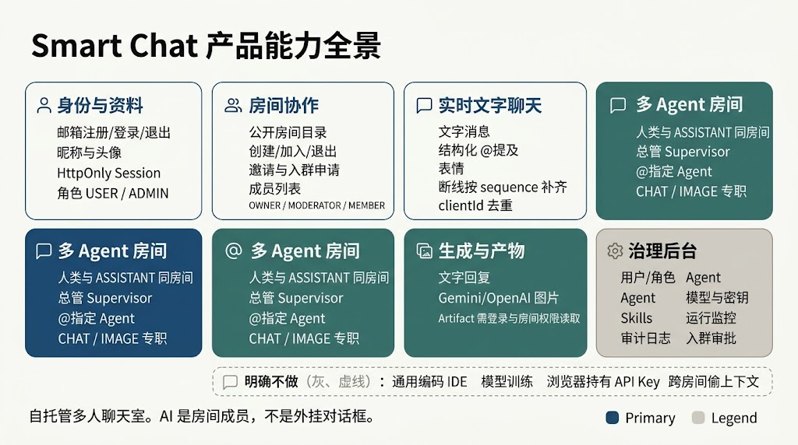
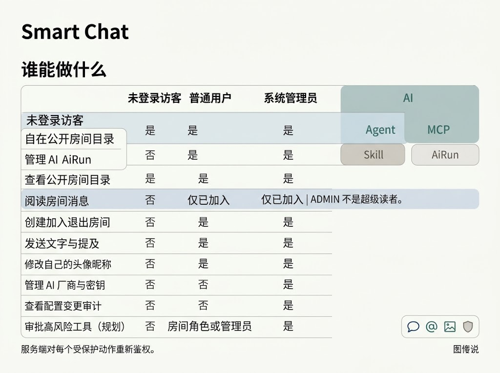
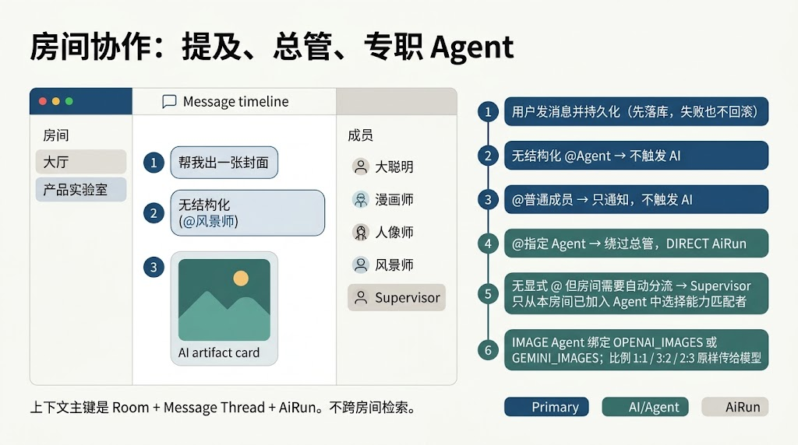
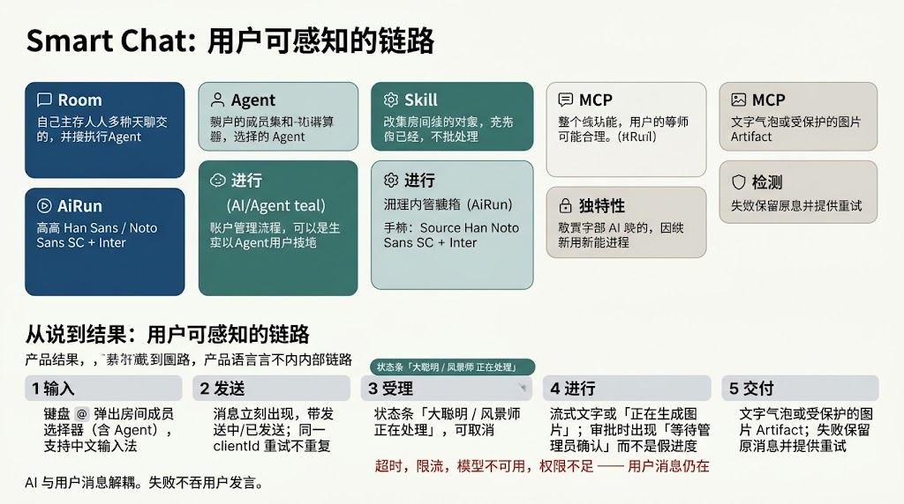
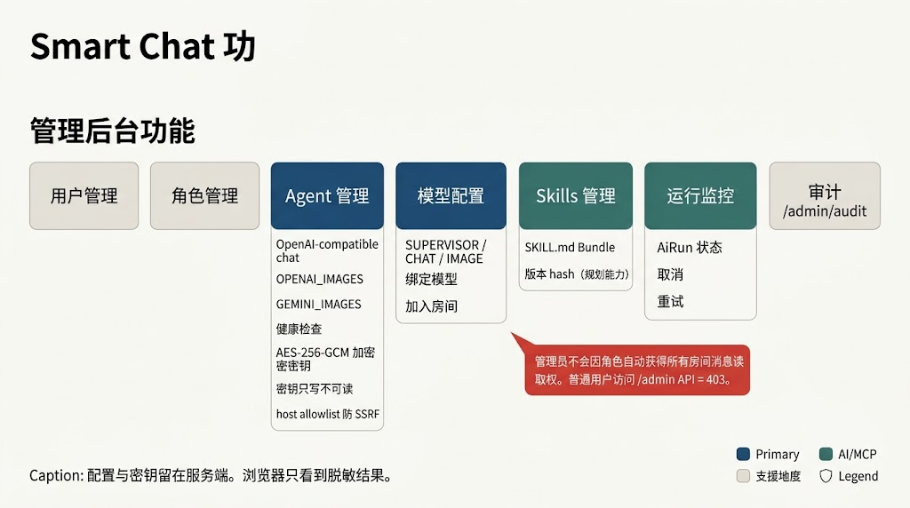
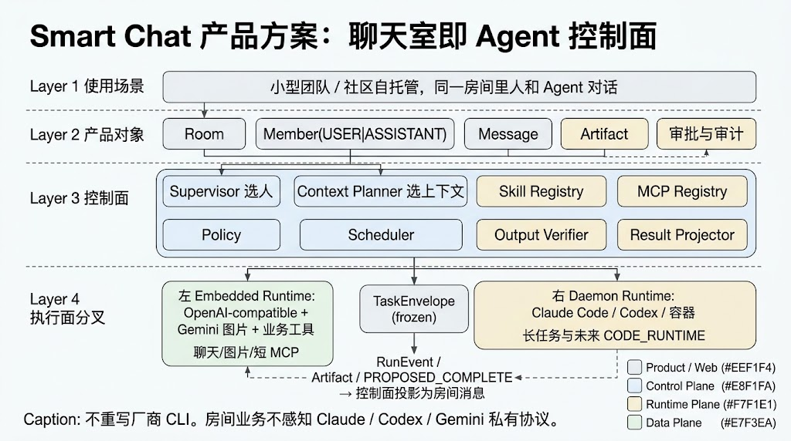
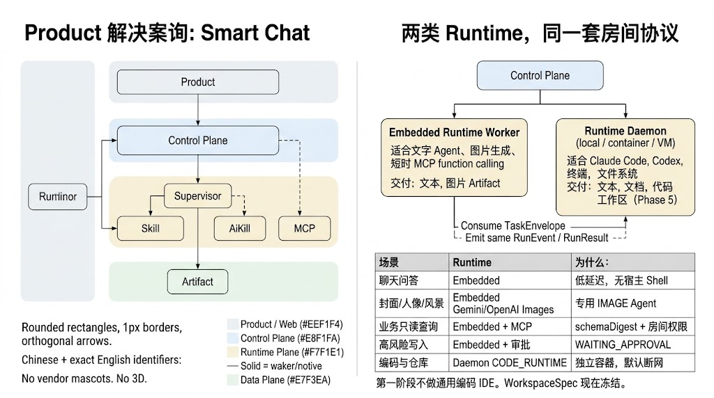
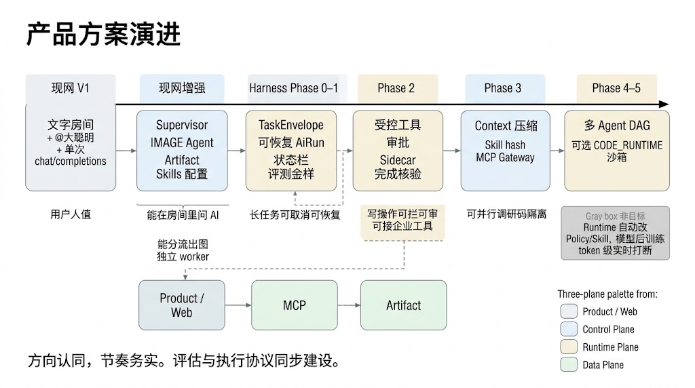

# Smart Chat 产品功能

日期：2026-09-01  
状态：对照现网实现与产品图修订  
配套：[技术架构](TECHNICAL_ARCHITECTURE.md) · [AI 运行时架构](AI_RUNTIME_ARCHITECTURE.md)  
依据：`docs/PRD.md`、现网 `README.md`、`src/` 实现、产品出图

Smart Chat 是可自托管的多人实时聊天室。人和 Agent 是同一房间里的成员，而不是外挂对话框。

---

## 1. 产品定位

面向小型团队和社区：同一房间内发文字、结构化 `@` 提及、调用专职 Agent 生成文字或图片。系统管理员在服务端配置模型、密钥、Agent 与 Skills；浏览器只持有 Session Cookie，从不持有 API Key。

上下文主键是 **Room + Message Thread + AiRun**。Agent 只看见当前房间、当前调用者有权读取的内容，不跨房间检索。

**现网已有**

- 邮箱注册 / 登录 / 退出，昵称与头像
- 公开房间目录，创建 / 加入 / 退出，邀请与入群申请
- 实时文字、结构化提及、表情；断线按 `sequence` 补齐，`clientId` 去重
- 人类与 `ASSISTANT` 同房间；总管 Supervisor；`@` 指定 Agent；`CHAT` / `IMAGE` 专职
- 文字回复，Gemini / OpenAI 图片，Artifact 需登录且为房间成员才能读
- 管理后台：用户、角色、Agent、模型与密钥、Skills、运行监控、入群审批、审计

**明确不做**

- 通用编码 IDE
- 模型训练或后训练
- 浏览器持有 API Key
- 跨房间偷上下文

---

## 2. 谁能做什么

服务端对每个受保护动作重新鉴权。管理员角色**不会**自动获得所有房间消息读取权。

| 能力 | 未登录访客 | 普通用户 | 系统管理员 |
| --- | --- | --- | --- |
| 查看公开房间目录 | 是 | 是 | 是 |
| 阅读房间消息 | 否 | 仅已加入 | 仅已加入 |
| 创建、加入、退出房间 | 否 | 是 | 是 |
| 发送文字与提及 | 否 | 是 | 是 |
| 修改自己的头像、昵称 | 否 | 是 | 是 |
| 管理 AI 厂商与密钥 | 否 | 否 | 是 |
| 查看配置变更审计 | 否 | 否 | 是 |
| 审批高风险工具 | 否 | 房间角色或管理员（规划） | 是（规划） |

系统角色是 `USER` / `ADMIN`。房间角色是 `OWNER` / `MODERATOR` / `MEMBER`。普通用户访问 `/admin` 页面或 API 一律 403。

---

## 3. 身份、房间、消息

### 3.1 身份与资料

- 邮箱规范化后唯一；密码使用 Argon2id 哈希，数据库不存明文。
- Session 使用 `HttpOnly` Cookie；登录和注册错误不泄露邮箱是否存在。
- 用户可改昵称与头像。头像走受控上传，服务端不抓取任意远程 URL。
- 页面：`/login`、`/register`、`/settings/profile`、`/settings/preferences`。

### 3.2 房间协作

- 访客可分页浏览、搜索公开且活跃的房间；不泄露成员或消息。
- 登录用户可创建房间。创建时创建者与默认 AI 成员（如「大聪明」）必须在同一事务中加入。
- 重复加入幂等。退出后旧 membership 不可复用；重新加入产生新的 membership epoch。
- 支持邀请与入群申请。非成员不得读消息、订阅实时频道或发消息。
- 数据模型已预留 `PRIVATE` / `INVITE_ONLY` / `ARCHIVED`，V1 目录默认仍是公开活跃房间。

### 3.3 实时文字

- V1 聊天以文字为主，附带表情。消息带 `clientId`；服务端按 `(roomId, senderMemberId, clientId)` 去重，并分配房间内单调递增的 `roomSequence`。
- 输入 `@` 弹出当前房间活跃成员选择器（含 Agent），支持键盘与中文输入法。
- mention 以结构化关联保存，不能只依赖正文里的 `@` 字符串。伪造 mention 会被拒绝。
- 实时通道是 SSE：`GET /api/rooms/:roomId/events`。断线后从最后确认的 sequence 补齐，不重复。

---

## 4. 房间里怎么叫 Agent

规则按顺序执行：

1. 用户消息先持久化。后续 AI 失败也不回滚这条发言。
2. 无结构化 `@Agent`，且房间未开启自动分流 → 不触发 AI。
3. `@普通成员` → 只通知，不触发 AI。
4. `@指定 Agent` → 绕过总管，创建 `DIRECT` 模式 `AiRun`。
5. 无显式 `@` 但房间启用 Supervisor → 总管只从**本房间已加入**的 Agent 中选能力匹配者，不得跨房间创造 Agent。
6. `IMAGE` Agent 绑定 `OPENAI_IMAGES` 或 `GEMINI_IMAGES`；聊天框选择的 `1:1` / `3:2` / `2:3` 原样传给模型。

每个触发消息最多产生一个有效 `AiRun`（按 `(triggerMessageId, mode)` 唯一）。种子数据包含「大聪明」以及漫画师、人像师、风景师；首次出图前需在后台绑定图片模型，并把 Agent 加入房间。

---

## 5. 从说到结果

| 步骤 | 用户看到什么 |
| --- | --- |
| 输入 | `@` 弹出成员选择器，含 Agent，支持中文输入法 |
| 发送 | 消息立刻出现，带发送中 / 已发送；同一 `clientId` 重试不重复 |
| 受理 | 状态条显示「大聪明 / 风景师正在处理」，可取消 |
| 进行 | 流式文字或「正在生成图片」；若需审批则显示「等待管理员确认」，不造假进度 |
| 交付 | 文字气泡，或需登录与房间权限才能读的图片 Artifact |

超时、限流、模型不可用、权限不足时，**原消息仍在**，并给出可重试的失败状态。AI 与用户消息解耦：失败不吞用户发言。

生成图片只能通过 `/api/artifacts/:id` 读取，接口校验登录态与房间成员身份。

---

## 6. 管理后台

现网 `/admin` 标签与实现对齐：

| 标签 | 能做什么 |
| --- | --- |
| 用户管理 | 查看、启停、改系统角色 |
| 角色管理 | 角色与权限绑定 |
| Agent 管理 | `SUPERVISOR` / `CHAT` / `IMAGE`，绑定模型，加入房间 |
| 模型配置 | OpenAI-compatible chat、`OPENAI_IMAGES`、`GEMINI_IMAGES`；健康检查；AES-256-GCM 加密密钥；密钥只写不可读；host allowlist 防 SSRF |
| Skills 管理 | 绑定 `SKILL.md` Bundle；版本 hash 是规划能力 |
| 运行监控 | 查看 `AiRun` 状态，取消、重试 |
| 入群申请 | 审批加入房间的请求 |
| 审计 `/admin/audit` | 按 actor / action / time 游标分页查看脱敏审计 |

配置与密钥留在服务端。浏览器只看到脱敏结果：是否已配置密钥，从不返回密钥片段。GET 响应、日志和客户端 bundle 中不得出现凭据。

---

## 7. 产品方案：聊天室即控制面

房间不只是消息流，也是 Agent 控制面：选人、选上下文、冻结任务、核验结果，再投影回房间消息。

四层对象：

1. **使用场景**：小型团队 / 社区自托管，同一房间里人和 Agent 对话。
2. **产品对象**：Room、Member（`USER` \| `ASSISTANT`）、Message、Artifact、审批与审计。
3. **控制面**：Supervisor 选人，Context Planner 选上下文，Skill / MCP Registry，Policy，Scheduler，Output Verifier，Result Projector。
4. **执行面**：Embedded Runtime 做聊天、图片、短 MCP；Daemon Runtime 做长任务与未来 `CODE_RUNTIME`。二者共用冻结的 `TaskEnvelope`。

房间业务不感知 Claude / Codex / Gemini 的私有协议。不重写厂商 CLI。

### 7.1 两类 Runtime 的产品含义

| 场景 | Runtime | 为什么 |
| --- | --- | --- |
| 聊天问答 | Embedded | 低延迟，无宿主 Shell |
| 封面 / 人像 / 风景 | Embedded Gemini / OpenAI Images | 专用 IMAGE Agent |
| 业务只读查询 | Embedded + MCP（规划） | `schemaDigest` + 房间权限 |
| 高风险写入 | Embedded + 审批（规划） | `WAITING_APPROVAL` |
| 编码与仓库 | Daemon `CODE_RUNTIME`（规划） | 独立容器，默认断网 |

第一阶段不做通用编码 IDE。`WorkspaceSpec` 现在冻结，避免以后改建协议。

---

## 8. 演进节奏

| 阶段 | 用户能得到什么 |
| --- | --- |
| 现网 V1 | 文字房间 + `@大聪明` + 单次 `chat/completions` |
| 现网增强 | Supervisor 分流、IMAGE Agent、Artifact、Skills 配置、独立 worker |
| Harness Phase 0–1 | 可取消可恢复的长任务，`TaskEnvelope`，评测金样 |
| Phase 2 | 写操作可拦可审；受控工具、Sidecar、完成核验 |
| Phase 3 | 接企业 MCP 工具；上下文压缩、Skill hash |
| Phase 4–5 | 多 Agent 并行调研；可选编码沙箱 |

非目标：Runtime 自动改 Policy / Skill、模型后训练、token 级实时打断。

方向认同，节奏务实。评估协议与执行协议同步建设。

---

## 9. 相关文档

- 需求原文：[PRD](PRD.md)
- 怎么落地：[技术架构](TECHNICAL_ARCHITECTURE.md)
- Agent 怎么跑：[AI 运行时架构](AI_RUNTIME_ARCHITECTURE.md)
- 决策边界：[ADR-001 Agent Runtime 职责](adr/ADR-001-agent-runtime-boundary.md)
