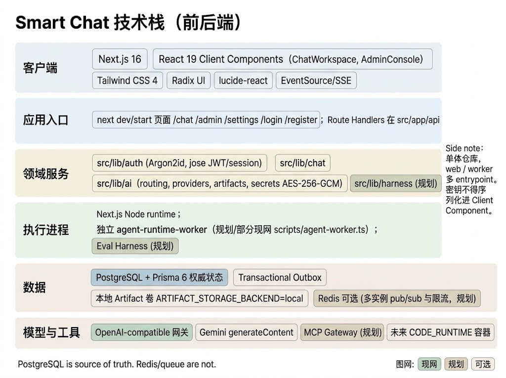
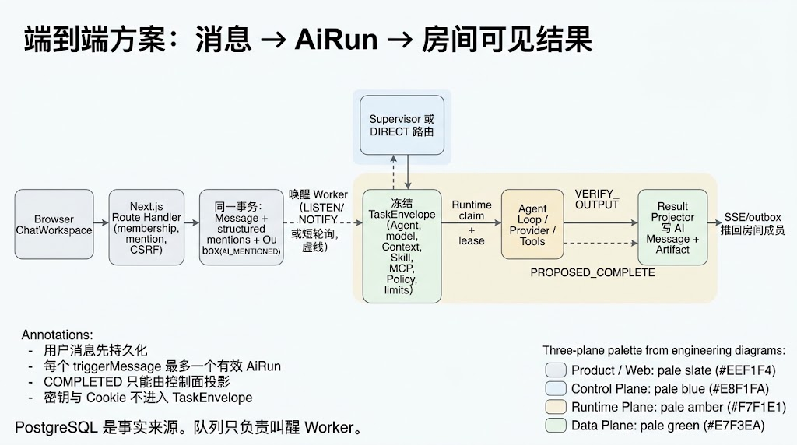
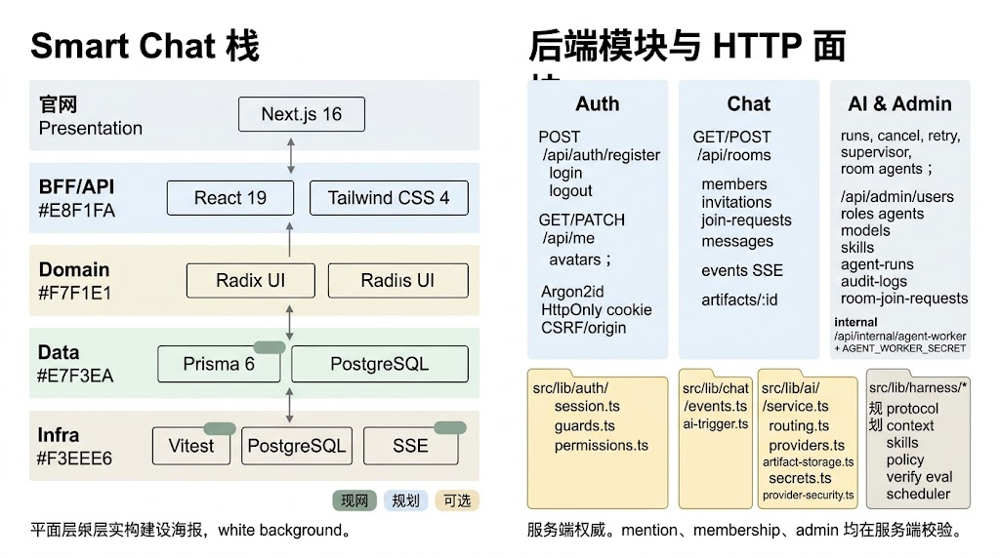
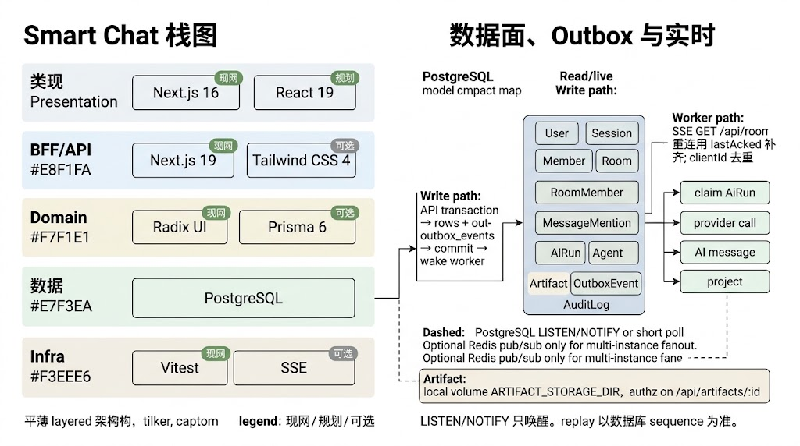
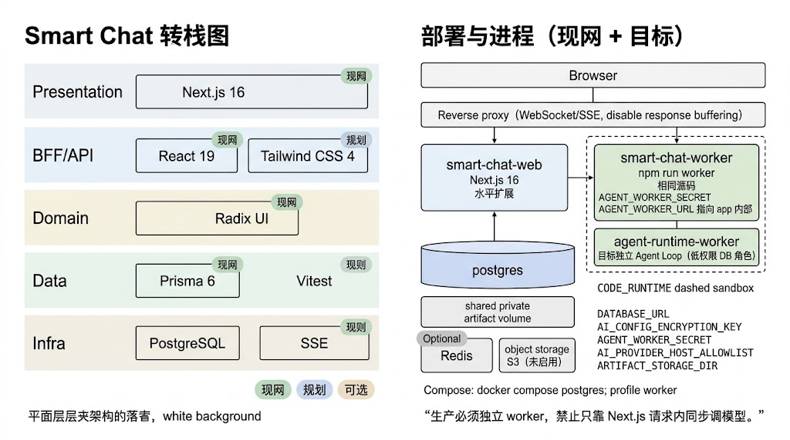
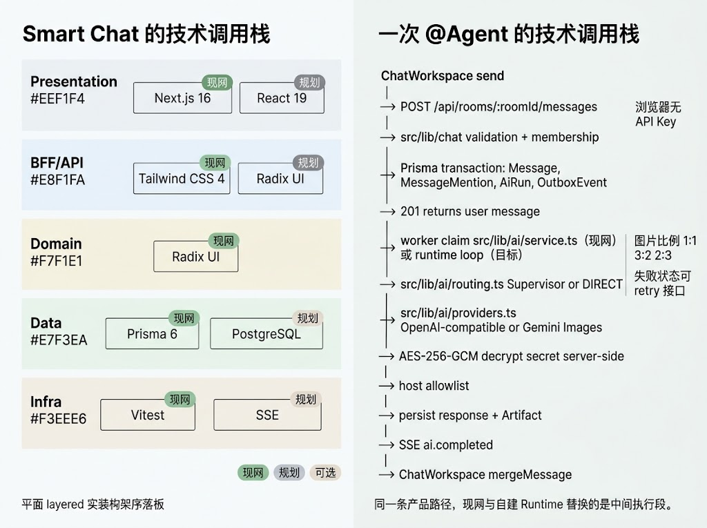
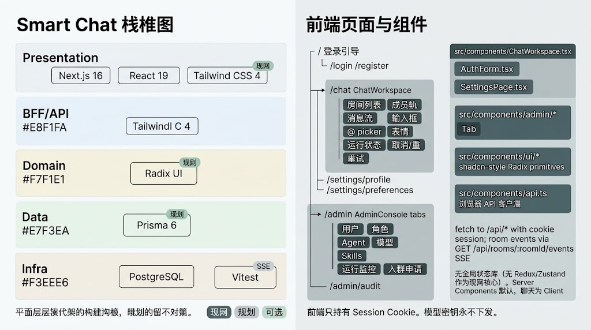
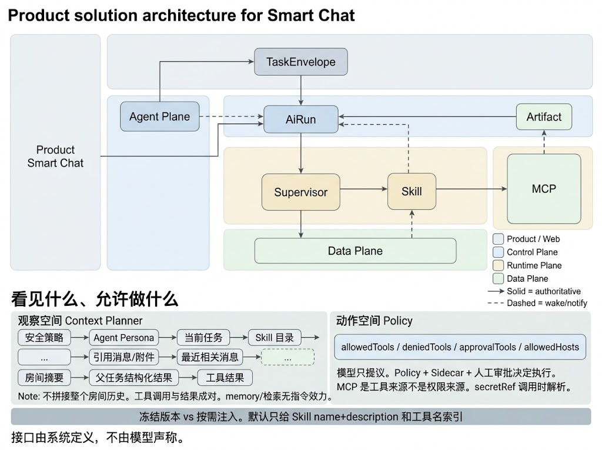

# Smart Chat 技术架构

日期：2026-09-01  
状态：对照现网代码、Prisma schema 与技术栈图修订  
配套：[产品功能](PRODUCT_FEATURES.md) · [AI 运行时架构](AI_RUNTIME_ARCHITECTURE.md)  
依据：`docs/IMPLEMENTATION_PLAN.md`、`README.md`、`prisma/schema.prisma`、`src/`

Smart Chat 是 Next.js 模块化单体：同一份源码，web 与 worker 两个进程入口。PostgreSQL 是事实来源；队列、SSE、LISTEN/NOTIFY 只负责叫醒和推送，不保存权威状态。

---

## 1. 原则

1. **服务端权威、最小权限。** membership、mention、AI、管理员操作均在服务端校验。
2. **先持久化，再发布。** 用户消息与 outbox 同事务写入；AI 失败不回滚用户发言。
3. **密钥不出浏览器。** Provider / MCP 凭据 AES-256-GCM 加密后只存在服务端；Client Component 不得序列化密钥。
4. **生产必须独立 worker。** 禁止只靠 Next.js 请求生命周期同步调模型。
5. **现网可跑，协议可演进。** 聊天、图片、Supervisor 已落地；Harness / 自建 Runtime 替换的是中间执行段，不改房间协议。

---

## 2. 分层技术栈



| 层 | 现网 | 规划 / 可选 |
| --- | --- | --- |
| 客户端 | Next.js 16 App Router、React 19 Client Components（`ChatWorkspace`、`AdminConsole`）、Tailwind CSS 4、Radix UI、lucide-react、EventSource/SSE | — |
| 应用入口 | `next dev/start`；页面 `/chat` `/admin` `/settings` `/login` `/register`；Route Handlers 在 `src/app/api` | — |
| 领域服务 | `src/lib/auth`（Argon2id、jose JWT/session）、`src/lib/chat`、`src/lib/ai`（routing、providers、artifacts、AES-256-GCM） | `src/lib/harness`（协议已部分落地） |
| 执行进程 | Next.js Node runtime；`npm run worker` → `scripts/agent-worker.ts` | 独立 `agent-runtime-worker`、Eval Harness |
| 数据 | PostgreSQL + Prisma 6；Transactional Outbox；本地 Artifact 卷 `ARTIFACT_STORAGE_BACKEND=local` | Redis（多实例 pub/sub 与限流）；S3 |
| 模型与工具 | OpenAI-compatible 网关、Gemini `generateContent` | MCP Gateway、`CODE_RUNTIME` 容器 |

单体仓库，web / worker 多 entrypoint。PostgreSQL 是 source of truth；Redis / 队列不是。

---

## 3. 前端信息架构



### 3.1 路由

| 路径 | 职责 |
| --- | --- |
| `/` | 登录引导 |
| `/login` `/register` | 凭证认证 |
| `/chat` | 房间列表、成员轨、消息流、输入框、`@` picker、表情、运行状态、取消 / 重试 |
| `/settings/profile` `/settings/preferences` | 资料与偏好 |
| `/admin` | 用户、角色、Agent、模型、Skills、运行监控、入群申请 |
| `/admin/audit` | 脱敏审计 |

### 3.2 组件与数据

- `src/components/ChatWorkspace.tsx`、`AuthForm.tsx`、`SettingsPage.tsx`
- `src/components/admin/*` 各 Tab
- `src/components/ui/*` shadcn 风格 Radix primitives
- `src/components/api.ts` 浏览器 API 客户端

数据获取：带 Cookie 的 `fetch /api/*`。房间事件：`GET /api/rooms/:roomId/events` SSE。

无 Redux / Zustand 作为现网核心状态库。默认 Server Components；聊天是 Client Component。前端只持有 Session Cookie，模型密钥永不下发。

---

## 4. 后端模块与 HTTP 面



服务端权威。mention、membership、admin 均在服务端校验。

### 4.1 Auth

- `POST /api/auth/register` `login` `logout`
- `GET/PATCH /api/me`，头像 `avatars`
- Argon2id、HttpOnly cookie、CSRF / origin 校验
- 代码：`src/lib/auth/session.ts`、`guards.ts`、`permissions.ts`

### 4.2 Chat

- `GET/POST /api/rooms`
- members、invitations、join-requests、messages
- SSE：`GET /api/rooms/:roomId/events`
- Artifact：`GET /api/artifacts/:id`
- 代码：`src/lib/chat/events.ts`、`ai-trigger.ts`、`validation.ts`

### 4.3 AI 与 Admin

- 房间侧：runs、cancel、retry、supervisor、room agents
- 管理侧：`/api/admin/users` `roles` `agents` `models` `skills` `agent-runs` `audit-logs` `room-join-requests`
- 内部：`/api/internal/agent-worker`，由 `AGENT_WORKER_SECRET` 保护
- 代码：`src/lib/ai/service.ts` `routing.ts` `providers.ts` `artifact-storage.ts` `secrets.ts` `provider-security.ts`
- Harness 规划目录：`src/lib/harness/{protocol,context,skills,policy,verify,eval,scheduler}`；协议 schema 已在 `protocol/` 落地

---

## 5. 数据面、Outbox 与实时



### 5.1 权威模型

Prisma 中与产品路径直接相关的模型：

| 域 | 模型 |
| --- | --- |
| 身份 | `User` `Session` `Role` `Permission` |
| 房间 | `Room` `RoomMember` `RoomJoinRequest` `RoomInvitation` `RoomSupervisor` |
| 消息 | `Message` `MessageMention` `OutboxEvent` |
| Agent | `Agent` `Model` `Skill` `AgentSkill` `AiRun` `Artifact` |
| 治理 | `AuditLog` |

关键约束：

- 每条用户消息 `(roomId, senderMemberId, clientId)` 唯一。
- `roomSequence` 在房间内唯一且不复用。
- `AiRun` 对 `(triggerMessageId, mode)` 唯一，避免同一触发消息重复有效运行。
- 密钥字段是 `ciphertext` / `secretRef`，不存明文。

### 5.2 写路径

```text
API 事务 → 业务行 + outbox_events → commit → 唤醒 worker
```

唤醒可用 PostgreSQL `LISTEN/NOTIFY` 或短轮询（虚线）。LISTEN/NOTIFY 只叫醒；replay 以数据库 sequence 为准。

### 5.3 读 / 直播路径

- SSE `GET /api/rooms/:roomId/events`
- 重连用 `lastAckedSequence` 补齐
- 客户端再按 `clientId` / `(roomId, roomSequence)` 去重
- 可选 Redis pub/sub 仅用于多实例 fan-out（规划，未启用）

### 5.4 Worker 路径（现网）

```text
claim AiRun（leaseGeneration CAS）
  → src/lib/ai/service.ts
  → provider call
  → persist AI message / Artifact
  → outbox + SSE 投影
```

Artifact 存在本地私有卷 `ARTIFACT_STORAGE_DIR`，授权发生在 `/api/artifacts/:id`。

---

## 6. 部署与进程



```text
Browser
  → Reverse proxy（WebSocket/SSE，关闭响应缓冲）
      → smart-chat-web（Next.js 16，可水平扩展）
      → smart-chat-worker（npm run worker，同一源码）
      → agent-runtime-worker（目标：独立 Agent Loop，低权限 DB 角色）
  → postgres
  → shared private artifact volume
  → Redis / S3（可选，未启用）
  → CODE_RUNTIME（规划，虚线沙箱）
```

生产必须独立 worker。开发环境允许 Next.js 进程内唤醒任务；生产禁止只靠请求内同步调模型。

关键环境变量（只列名字，不列值）：

- `DATABASE_URL`
- `AI_CONFIG_ENCRYPTION_KEY`
- `AGENT_WORKER_SECRET`
- `AGENT_WORKER_URL`（worker 指向 app 内部接口）
- `AI_PROVIDER_HOST_ALLOWLIST`
- `ARTIFACT_STORAGE_DIR`
- `AGENT_RUNTIME_MODE`（`legacy` \| `embedded` \| `self_hosted`）

Compose：`docker compose up -d postgres`；worker 用 profile：`docker compose --profile worker up -d worker`。

反向代理必须支持流式传输并关闭相关响应缓冲，否则 SSE / 图片生成状态会卡住。

---

## 7. 一次 `@Agent` 的调用栈

同一条产品路径。现网与自建 Runtime 替换的是中间执行段。



```text
ChatWorkspace send
  → POST /api/rooms/:roomId/messages
  → src/lib/chat 校验 membership / mention / CSRF
  → Prisma 事务：Message、MessageMention、AiRun、OutboxEvent
  → 201 返回用户消息（浏览器无 API Key）
  → worker claim
        现网：src/lib/ai/service.ts
        目标：runtime loop
  → src/lib/ai/routing.ts  Supervisor 或 DIRECT
  → src/lib/ai/providers.ts  OpenAI-compatible 或 Gemini Images
  → AES-256-GCM 服务端解密密钥
  → host allowlist
  → persist response + Artifact
  → SSE ai.completed
  → ChatWorkspace mergeMessage
```

图片比例 `1:1` `3:2` `2:3` 原样传给模型。失败状态走 retry 接口；重试不继承管理员权限，始终使用原 `callerMemberId` 的上下文授权。

---

## 8. 端到端：消息 → AiRun → 房间可见结果



四条硬规则：

1. 用户消息先持久化。
2. 每个 `triggerMessage` 最多一个有效 `AiRun`。
3. `COMPLETED` 只能由控制面投影；Runtime 最多申报 `PROPOSED_COMPLETE`（目标协议）。
4. 密钥与 Cookie 不进入 `TaskEnvelope`。

PostgreSQL 是事实来源。队列只负责叫醒 Worker。

现网 `AiRun` 已具备 claim、租约、取消、重试、父子关系、`runtimeId` / `taskDigest` / `skillBundleHash` 等元数据字段，为切换 Runtime 预留了列，但执行循环仍主要在 `src/lib/ai/service.ts`。

---

## 9. 看见什么、允许做什么



### 9.1 观察空间（Context Planner）

优先级从高到低：

```text
安全策略
→ Agent Persona
→ 当前任务
→ Skill 目录
→ 引用消息 / 附件
→ 最近相关消息
→ 房间摘要
→ 父任务结构化结果
→ 工具结果
```

不拼接整个房间历史。工具调用与结果成对。memory / 检索无指令效力。现网文本路径实际读取当前房间最近 30 条消息，再按 token budget 截断。

### 9.2 动作空间（Policy）

- 字段：`allowedTools` / `deniedTools` / `approvalTools` / `allowedHosts`
- 模型只提议。Policy + Sidecar + 人工审批决定执行。
- MCP 是工具来源，不是权限来源。`secretRef` 调用时解析。
- 冻结版本 vs 按需注入：默认只给 Skill name + description 和工具名索引。
- 接口由系统定义，不由模型声称。

协议实现见 `src/lib/harness/protocol/policy.ts` 与 `task-envelope.ts`。

---

## 10. 安全与可靠性基线

| 主题 | 现网做法 |
| --- | --- |
| 认证 | Argon2id、session 撤销、登录 / 注册限流 |
| CSRF | Cookie 写操作校验 origin |
| XSS | 输出按纯文本；V1 不渲染 Markdown / HTML |
| IDOR | 每个房间 API、SSE、replay、AI context 走同一 membership policy |
| SSRF | Provider base URL 协议 / host allowlist，禁止跳到非白名单地址 |
| 密钥 | envelope encryption：ciphertext + nonce + keyVersion；启动缺 key fail closed |
| 限流 | Auth、消息、AI、admin 分层 |
| 日志 | 排除正文、Cookie、Authorization、provider payload |
| 幂等 | 消息 `clientId`、AiRun unique、retry `idempotencyKey`、lease CAS |

管理员不是超级读者。普通用户打 admin API = 403。

---

## 11. 相关代码与文档

| 主题 | 位置 |
| --- | --- |
| Schema | `prisma/schema.prisma` |
| Worker | `scripts/agent-worker.ts`、`src/app/api/internal/agent-worker/route.ts` |
| 现网执行 | `src/lib/ai/service.ts` |
| 任务协议 | `src/lib/harness/protocol/task-envelope.ts` |
| Runtime 抽象 | `src/lib/harness/runtime/types.ts` |
| 实施方案原文 | [IMPLEMENTATION_PLAN](IMPLEMENTATION_PLAN.md) |
| Runtime 细节 | [AI 运行时架构](AI_RUNTIME_ARCHITECTURE.md) |
